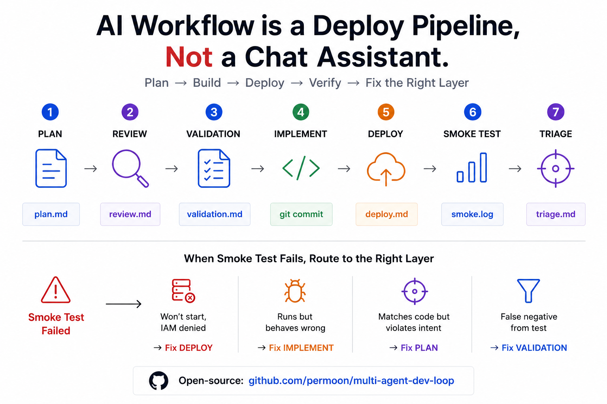

# multi-agent-dev-loop

> **別讓單一 agent 在同一條脆弱的對話裡，包辦計畫、寫 code、部署、除錯。**
> 給高風險自主開發一套有紀律的工作流：每一步都產出一份檔案，可稽核、可恢復、可回溯。

[](LICENSE)
[](https://github.com/permoon/multi-agent-dev-loop/stargazers)



把 **Claude + Codex + Gemini** 串成固定 8 步流程：

```text
計畫 → 審查 → 實作 → 審查 → 部署 → smoke test → triage → 回顧
```

每一步產出固定 artifact。失敗時自動分流回正確的 step。

[English](./README.md)

## 跟直接用 Claude Code 有什麼不同？

Claude Code 給你 agent 和工具，這個 skill 給你**工作紀律**：固定的步驟順序、單獨的計畫審查、高風險工作的 red team 關卡、部署後 smoke test、和無偏見的回顧。重點不是更多 agent，而是清楚的責任歸屬，和事情壞掉時有東西可以追。

## 為什麼需要它

AI agent 很會衝刺，但高風險工作真正困難的不是速度，而是讓計畫、假設、驗證、回滾路徑和部署證據在數小時的 context 裡保持一致。

**沒有這個 skill：**

- 一個 agent 包辦計畫、code、部署、除錯，全在一條脆弱對話裡
- 失敗時就地補丁，沒人知道哪個假設壞了
- context 切換或 session 中斷，工作很難接手
- review 都在 chat 裡跑掉，什麼都沒留下

**有了這個 skill：**

- 每一步寫進固定檔案（`plan.md`、`validation.md`、`deviations.md`...）
- 計畫先被第二個 agent 審查，才開始寫 code
- 大爆炸半徑的工作有 red-team 關卡
- 部署後 smoke test 失敗自動分流回對的 step（計畫 / code / 部署 / 驗證）
- 無偏見的回顧會幫流程本身打分數，讓 skill 持續改進

## 何時使用

適合用在非簡單實作工作：

- 多檔 feature 或 refactor
- 架構決策
- schema、IAM 或資料變更
- 部署與 migration
- 有 rollback 風險
- blast radius 大
- 需要可追蹤或可恢復的工作

不適合：

- 錯字和單行修改
- 純格式調整
- 純探索或問答
- 不會部署的一次性腳本
- 明確的 quick fix

## 它會做什麼

| 步驟 | 負責人 | 產出 |
|---|---|---|
| 1. 計畫 | Claude | `plans/<feature>/plan.md` + `validation.md`（Pass 1）|
| 2. 計畫審查（第一輪）| Codex | `plans/<feature>/review-codex-round1.md` |
| 3. 修正 + 二審（第二輪）| Claude + Codex | `plans/<feature>/review-codex-round2.md` |
| 3.5. Red team，條件式 | Claude + Codex + Gemini | `plans/<feature>/red-team.md` + 修訂後的 `validation.md`（Pass 2）|
| 4. 實作 | Codex | 程式碼 + `plans/<feature>/deviations.md` + `scripts/smoke/<feature>.sh` |
| 5. Code review | Claude | `plans/<feature>/review-claude.md`（直接修正或退回 Codex）|
| 6. 部署 review，GCP 條件式 | Gemini | `plans/<feature>/review-gemini.md` |
| 7. 驗證 + triage | Claude | `runs/<timestamp>-<feature>/{smoke.log,triage.md}` |
| 8. 自我評估 | Claude subagent | `plans/<feature>/evaluation.md`（並週期性產生 `runs/rollup-<YYYYMM>.md`）|

如果 smoke test 失敗，skill 會分類並分流：

| 失敗類型 | 分流 |
|---|---|
| 部署失敗：服務起不來、IAM 拒絕、設定錯誤 | Step 6 |
| 部署成功但行為錯 | Step 4 |
| 行為符合 code，但不符合計畫意圖 | Step 1 |
| Smoke test 誤判 | 修 `validation.md`，再從 Step 4 重跑 |

## 安裝

這個 repo 現在是 standalone skill。把整個 repo 資料夾複製到你的 agent
環境使用的 skills 目錄即可。

Codex：

```bash
mkdir -p ~/.codex/skills
cp -R /path/to/multi-agent-dev-loop ~/.codex/skills/
```

Claude Code 或其他支援 skill 的環境，請把這個資料夾複製到該工具設定的
skills 目錄。

skill 入口是：

```text
SKILL.md
```

## 前置需求

- `codex` CLI 已安裝並登入，且 `codex exec --help` 可正常執行
- `gemini` CLI 已安裝並登入，用於 red-team 與 GCP deploy review
- 一個可建立 artifact tree 的工作目錄

Gemini 只在條件式 red-team 與 GCP deploy review 需要。

## Artifact tree

```text
plans/<feature>/
  plan.md
  validation.md
  red-team.md
  review-codex-round1.md
  review-codex-round2.md
  deviations.md
  review-claude.md
  review-gemini.md
  evaluation.md
deploy/<feature>/
scripts/smoke/<feature>.sh
runs/<timestamp>-<feature>/
  smoke.log
  triage.md
runs/rollup-<YYYYMM>.md
```

`<feature>` 使用 kebab-case，例如 `workflow-daily-ingest`。
`<timestamp>` 使用 `YYYYMMDD-HHMMSS`。

## 輸出規範

每一步結束只回報三行：

```text
Step: <剛完成的步驟>
Artifact: <產出的檔案路徑>
Next: <下一步或卡關原因>
```

大型輸出寫進檔案，不貼在 chat。

## 範例

使用者要求：

```text
Add a daily aggregate table analytics.daily_user_summary and a workflow to
refresh it at 6am.
```

skill 會產生：

- 具體 implementation plan 與 two-pass validation plan
- 兩輪 Codex review notes，挑戰 schema、IAM、部署順序和 smoke 覆蓋率
- 實作、`deviations.md` 稽核紀錄與 idempotent smoke test
- Claude code review notes（`review-claude.md`）
- 如果 GCP 風險高，進行 Gemini deploy review
- smoke-test output，以及驗證失敗時的 triage
- 無偏見的回顧（`evaluation.md`），針對 plan quality、review usefulness、implementation drift 與 trigger correctness 評分

## 如果你覺得有用

- 給 repo 一顆星，方便之後回來找
- 開 issue 講你想用在什麼樣的工作上 — 這會決定後續加什麼
- skill 設計上就是要被 fork 改造的：複製到你的 skills 資料夾，把步驟改成你的 stack 用得順的版本

## License

[MIT](LICENSE)
